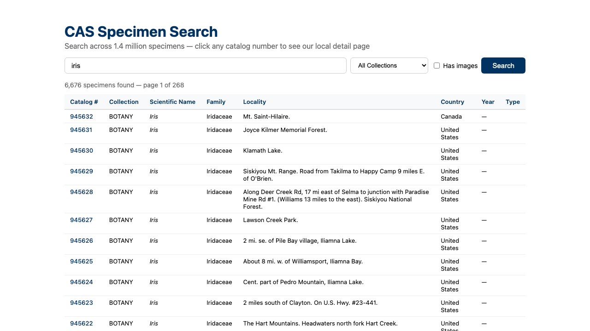
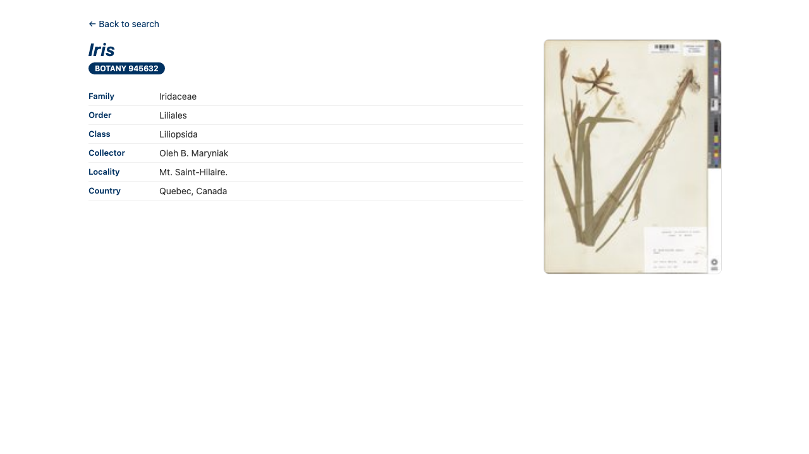
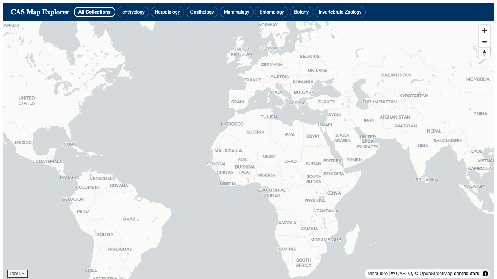
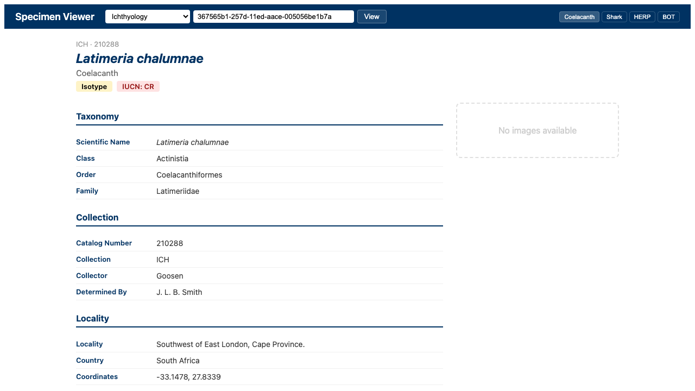
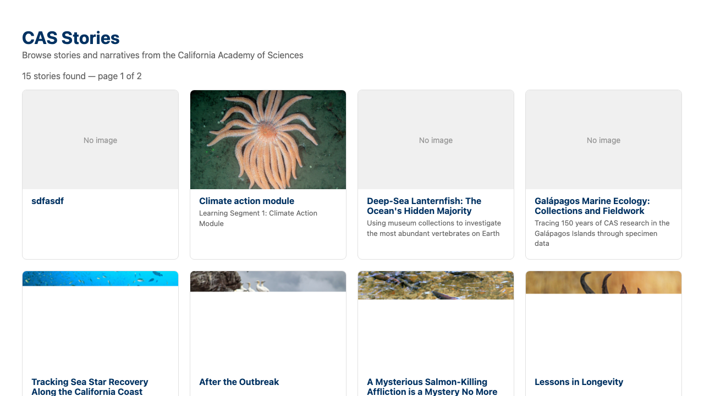
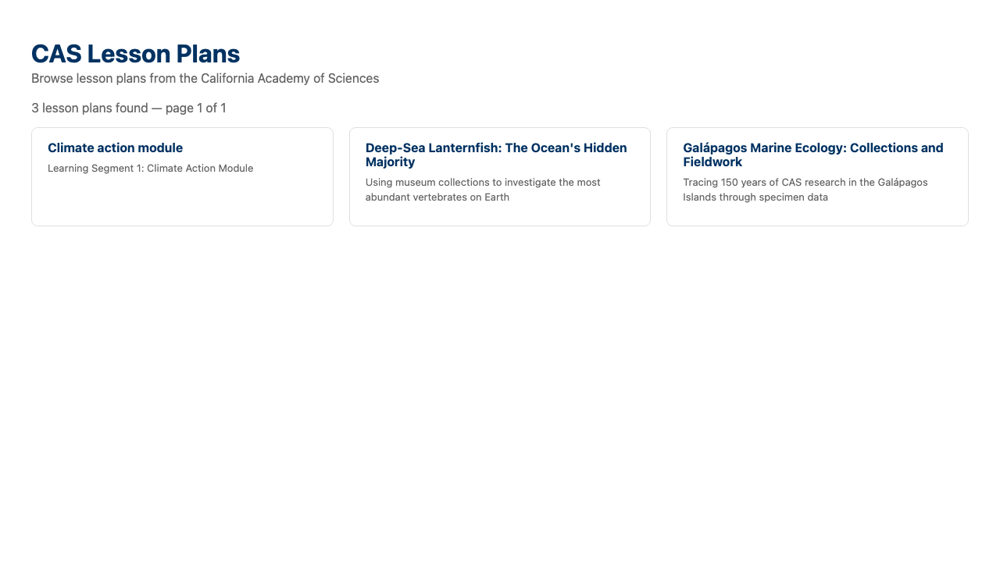
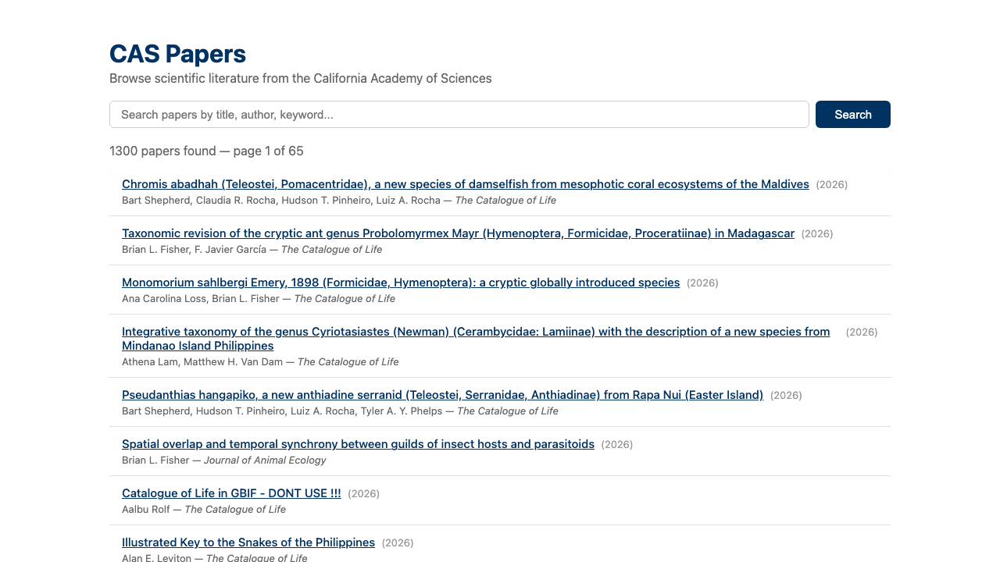

# Lens Apps

Example apps built on top of [CAS Lens](https://github.com/calacademy-research/cas-lens), the California Academy of Sciences collections platform.

## Why this exists

Different teams at CAS need different things from the collections data. The education team might want a lesson plan finder. A researcher might want a specialized map for a single taxon. IT might want a dashboard. Each team could build their tool from scratch — export some data, put it in their own database, write their own search. But that creates problems:

- **Data islands.** Each tool has its own copy of the data, updated on its own schedule (or not at all). A specimen record gets corrected in the main database, but the lesson plan finder still shows the old name. A new paper is published, but the researcher's dashboard doesn't know about it.

- **Duplicated effort.** Every tool reimplements search, pagination, taxonomy lookups, geographic filtering. Bugs get fixed in one place but not the others. Improvements don't propagate.

- **Maintenance burden.** Each tool is a full application with its own data pipeline, its own deployment, its own bugs. When the main database schema changes, everything breaks independently.

These apps take a different approach: **call the live CAS Lens API at query time.** No data copies, no sync jobs, no separate databases. Your app is 80-250 lines of code that fetches current data and renders it your way. When a specimen record is updated, a story is published, or a paper is added, every app that uses the API reflects it immediately.

## What you can use

CAS Lens is a large application — specimen search, maps, detail pages, stories, lesson plans, literature, expeditions, collector profiles, and more. This repo shows how to take pieces of that system and use them in your own app, without adopting the whole thing.

You can plug in at different levels:

- **Just the data** — call the API with `getApiClient()`, get JSON back, render it yourself. The `papers-browser` and `stories-browser` apps work this way. You're using CAS Lens as a data source.

- **Data + state management** — use the hooks (`useSearchQuery`, `useSearchFilters`, `useMapState`, `usePaginationState`) to manage search/filter/pagination state. You get the same state logic the main app uses, but render your own UI.

- **Data + vector tiles** — use the CAS tile server directly with MapLibre GL to render 1.4M+ specimens on a map with GPU-accelerated clustering. The `map-explorer` app does this. You get the same map data as the main app, rendered in your own layout.

- **Data + link routing** — use the link builder to keep navigation within your app. When a user clicks a specimen, story, or paper, the link points to your page, not `collections.calacademy.org`. The `search-tool` app demonstrates this with a local specimen detail page.

You choose how much to take. Use one endpoint and build everything else yourself, or use the hooks and state management and just swap the UI. Each example app shows a different point on that spectrum.

If you can write Python, you can read this code — the concepts are the same (fetch data from an API, render it), just in JavaScript/TypeScript instead.

## What these apps look like

### search-tool — Specimen search with local detail pages

Search across 1.4 million specimens. Click any catalog number to see a detail page that lives within your app, not on the CAS website.



Click a specimen to see your own detail page with taxonomy, collection info, and images:



### map-explorer — Interactive map

All specimens plotted on a map using vector tiles. Click collection pills to filter by department.



### specimen-viewer — Specimen detail

Look up any specimen by UUID and see its full record — taxonomy, collector, locality, coordinates, images, and conservation status.



### stories-browser — Stories and narratives

Browse published stories from CAS — scientific narratives with images, themes, and editorial content.



### lessons-browser — Lesson plans

Browse educational lesson plans from CAS, filterable by grade level and subject.



### papers-browser — Scientific literature

Search and browse 1,300+ scientific papers published by CAS researchers, with DOI links.



## Concepts for non-web developers

If you're coming from Python or another language, here's a quick orientation.

### What is React?

React is a JavaScript library for building user interfaces. Instead of generating HTML on a server (like Flask or Django templates), React runs in the browser and builds the page dynamically. You write **components** — functions that return what the UI should look like — and React keeps the screen in sync with your data.

```tsx
// A React component is just a function that returns markup
function Greeting({ name }) {
  return <h1>Hello, {name}</h1>;
}
```

### What is Vite?

Vite is the development server. It's the equivalent of `python -m http.server` but for React apps — it serves your code to the browser, watches for changes, and reloads automatically. You start it with `npm run dev`.

### What is an API call?

Same as in Python. The CAS API is a REST service at `collections.calacademy.org/api`. Instead of `requests.get()`, JavaScript uses `axios` or `fetch()`:

```python
# Python
response = requests.get('https://collections.calacademy.org/api/search', params={'q': 'iris'})
data = response.json()
```

```tsx
// JavaScript (what these apps do)
const client = getApiClient();
const response = await client.get('/search', { params: { q: 'iris' } });
const data = response.data;
```

### What is a "proxy"?

Browsers block requests from `localhost` to `collections.calacademy.org` for security reasons (this is called CORS). The proxy is a workaround: your dev server intercepts requests to `/api` and forwards them to the real server. Your code calls `/api/search` and the dev server turns that into `https://collections.calacademy.org/api/search` behind the scenes. This is configured in `vite.config.ts`.

### What is npm?

npm is the package manager for JavaScript — like `pip` for Python. `npm install` installs dependencies (like `pip install -r requirements.txt`), and `npm run dev` runs the development server.

### What is TypeScript?

TypeScript is JavaScript with type annotations. If you've used Python type hints (`def search(query: str) -> list[Specimen]:`), it's the same idea. The `.tsx` file extension means TypeScript + JSX (the HTML-like syntax React uses).

## How the apps work

Every app follows the same pattern:

1. **Wrap your app in `CASLensProvider`** — this sets up the API connection
2. **Pull in what you need** — data via `getApiClient()`, state via hooks, tiles via URL
3. **Render it your way** — your code, your layout, your design

```tsx
import { CASLensProvider, getApiClient } from '@calacademy-research/cas-lens';

export default function App() {
  return (
    <CASLensProvider apiBase="/api">
      <MyComponent />
    </CASLensProvider>
  );
}

function MyComponent() {
  // getApiClient() returns an HTTP client, like requests.Session() in Python
  const client = getApiClient();
  // Now call any CAS API endpoint
}
```

The same principle applies to behavior, not just data. Instead of reimplementing search state management or filter logic, you import `useSearchQuery()` and get the same logic the main app uses. When it's improved, your app gets the improvement.

### Link builder

When your app displays CAS data, you want clicks to navigate within your app — not to `collections.calacademy.org`. The `links` prop on `CASLensProvider` controls this:

```tsx
<CASLensProvider
  apiBase="/api"
  links={{
    // When anything in the app generates a specimen link,
    // use this URL pattern instead of the CAS default
    specimen: (id, collection) => `/my-page/${id}`,
  }}
>
```

The `search-tool` app demonstrates this end to end: search results link to a local detail page at `/specimen/:id` instead of the CAS website.

## Running an app

```bash
# 1. Clone this repo
git clone git@github.com:calacademy-research/lens-apps.git
cd lens-apps

# 2. Pick an app and install its dependencies
cd search-tool
npm install

# 3. Start the development server
npm run dev
```

Open the URL shown in the terminal (usually `http://localhost:5173`).

Each app is independent. They don't share dependencies or state. You can run multiple apps at once on different ports.

## Project structure

```
lens-apps/
├── search-tool/          ← specimen search + local detail pages
│   ├── src/App.tsx        ← all the app code (one file)
│   ├── vite.config.ts     ← dev server config with API proxy
│   ├── package.json       ← dependencies
│   └── index.html         ← entry point
├── map-explorer/         ← interactive vector tile map
├── specimen-viewer/      ← specimen detail lookup
├── stories-browser/      ← CAS stories card grid
├── lessons-browser/      ← lesson plans card grid
├── papers-browser/       ← searchable literature list
└── docs/
    ├── getting-started.md ← build your first app from scratch
    ├── api-reference.md   ← all exports, endpoints, and types
    └── screenshots/       ← app screenshots
```

Each app is a single `App.tsx` file (80-250 lines) plus boilerplate config files. The `App.tsx` is the only file you need to read to understand what the app does.

## Available API endpoints

These are the CAS API endpoints the apps use. All return JSON.

| Endpoint | What it returns | Example app |
|----------|----------------|-------------|
| `/api/search?q=iris&per_page=25` | Specimen search results | search-tool |
| `/api/specimens/{uuid}` | Single specimen record | specimen-viewer, search-tool |
| `/api/stories?page=1&per_page=12` | Published stories | stories-browser |
| `/api/stories?content_type=lesson_plan` | Lesson plans | lessons-browser |
| `/api/literature?page=1&per_page=20&q=coral` | Scientific papers | papers-browser |
| `/api/collections` | List of all collections | any |
| `/tiles/{collection}/{z}/{x}/{y}.pbf` | Vector map tiles | map-explorer |

## Further reading

- [Getting Started](docs/getting-started.md) — build your first app from scratch, step by step
- [API Reference](docs/api-reference.md) — all exports, hooks, types, endpoints, and collection codes
- [CAS Lens](https://github.com/calacademy-research/cas-lens) — the main CAS Lens project this builds on
